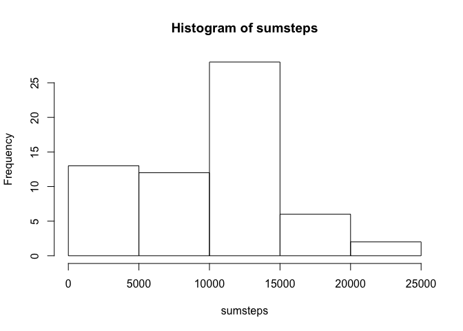
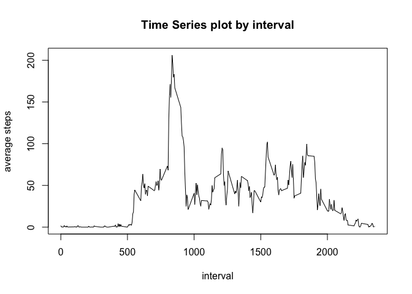
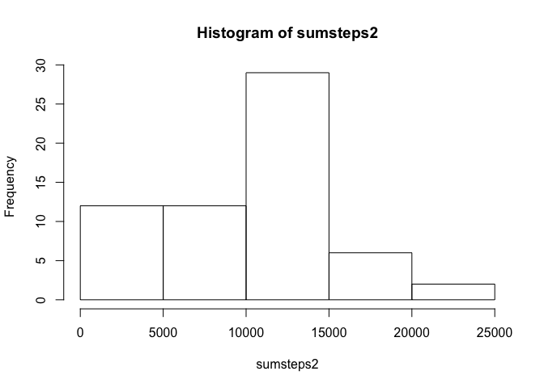

# Reproducible Research: Peer Assessment 1


```r
options(scipen=999) # turn off scientific notation
```

## Loading and preprocessing the data

```r
unzip("activity.zip")
dat <- read.csv("activity.csv")
head(dat)
```

```
##   steps       date interval
## 1    NA 2012-10-01        0
## 2    NA 2012-10-01        5
## 3    NA 2012-10-01       10
## 4    NA 2012-10-01       15
## 5    NA 2012-10-01       20
## 6    NA 2012-10-01       25
```

## What is mean total number of steps taken per day?

```r
sumsteps <- tapply(dat$steps,dat$date,sum,na.rm=TRUE)
head(sumsteps)
```

```
## 2012-10-01 2012-10-02 2012-10-03 2012-10-04 2012-10-05 2012-10-06 
##          0        126      11352      12116      13294      15420
```

```r
hist(sumsteps)
```

 

The mean is ``9354.23`` and the median is ``10395``

## What is the average daily activity pattern?

```r
avgsteps <- aggregate(dat$steps,by=list(dat$interval),mean,na.rm=TRUE)
plot(x ~ Group.1, avgsteps, xlab = "interval", ylab = "average steps", main = "Time Series plot by interval", type="l")
```

 

```r
maxstep <- avgsteps[which.max(avgsteps$x),]
```

Maximum Interval ``835`` and its corresponding value ``206.17``

## Imputing missing values

```r
sum(is.na(dat))
```

```
## [1] 2304
```

```r
dat2 <- dat
dat2[is.na(dat2$steps),]$steps <- avgsteps[avgsteps$Group.1==dat2[is.na(dat2$steps),]$interval,"x"]
head(dat2)
```

```
##       steps       date interval
## 1 1.7169811 2012-10-01        0
## 2 0.3396226 2012-10-01        5
## 3 0.1320755 2012-10-01       10
## 4 0.1509434 2012-10-01       15
## 5 0.0754717 2012-10-01       20
## 6 2.0943396 2012-10-01       25
```

```r
sumsteps2 <- tapply(dat2$steps,dat2$date,sum,na.rm=TRUE)
head(sumsteps2)
```

```
## 2012-10-01 2012-10-02 2012-10-03 2012-10-04 2012-10-05 2012-10-06 
##   10766.19     126.00   11352.00   12116.00   13294.00   15420.00
```

```r
hist(sumsteps2)
```

 

The mean is ``9530.72`` and the median is ``10439``

The mean and median changed a bit (higher than before). The total daily number of steps increase since some missing data are filled in.

## Are there differences in activity patterns between weekdays and weekends?


```r
dat2["Weekdays"] <- weekdays(as.Date(dat2$date))
dat2$Weekdays[dat2$Weekdays=="Saturday"] <- "Weekend"
dat2$Weekdays[dat2$Weekdays=="Sunday"] <- "Weekend"
dat2$Weekdays[dat2$Weekdays!="Weekend"] <- "Weekday"
dat2$Weekdays <- factor(dat2$Weekdays)

avgsteps2 <- aggregate(dat2$steps,by=list(dat2$interval,dat2$Weekdays),mean,na.rm=TRUE)
library("lattice")
xyplot(avgsteps2$x ~ avgsteps2$Group.1 | avgsteps2$Group.2,
       layout = c(1, 2), type = "l", 
       xlab = "interval", ylab = "average steps")
```

 
